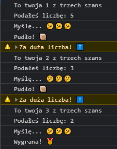

## Guess game

Celem gry jest wylosowanie tajnej liczby z zakresu od 1 do 10 przez komputer, a następnie pobieranie liczb od użytkownika (za pomocą metody `window.prompt()`) z tego zakresu.

Każdy użytkownik ma trzy szanse i na początku każdej "tury" informujemy użytkownika o ilości szans jaką posiada. Po tym jak użytkownik wprowadzi liczbę imitujemy "myślenie" komputera, które powinno dać wrażenie użytkownikowi "sprawdzania liczby przez komputer" i po około dwóch sekundach powinniśmy użytkownika poinformować czy trafił wylosowaną liczbę. Jeśli tak to kończymy grę wyswietlając komunikat o wygranej, jeżeli użytkownik po trzech próbach nie trafił kończymy grę informując o porażce.

Żeby ułatwić użytkownikowi odgadnięcie liczby wyświetlaj po każdej nieudanej próbie odgadnięcia komunikat, czy liczba którą przekazał jest "za duża" czy "za mała".

Gra może wyglądać w ten sposób:

**Podpowiedź:** Do tego zadania może Ci się przydać [rekurencja](https://pl.wikipedia.org/wiki/Rekurencja).
